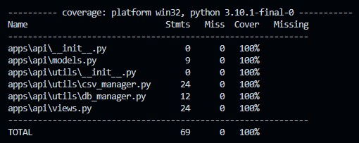

# AFNOR TECHNICAL TEST

As a member of the AFNOR Group, i decided to do the technical test used for the recruitment.

- [AFNOR TECHNICAL TEST](#afnor-technical-test)
  - [Test Coverage](#test-coverage)
  - [Installation](#installation)
  - [Workflow](#workflow)
  - [Route](#route)
    - [get/](#get)
    - [get/\<numdos\>](#getnumdos)

## Test Coverage



## Installation

If you want to clone the repo for development purpose, please do as follow:

```bash
your/repository> git clone https://github.com/jordan95v/afnor_technical_test.git
your/repository> cd afnor_technical_test/
your/repository/afnor_technical_test> python -m venv venv
your/repository/afnor_technical_test> .venv/Scripts/activate #venv\bin\activate on Mac and Linux
(venv)your/repository/afnor_technical_test> pip install -r requirements.txt -r requirements-dev.txt
```

Then you can lauch the development server and have fun with the code ! 

## Workflow

Since we where given a CSV to construct the database, i did a custom command that makes the insertion.
To upload the csv and fill the database simply do as follow:

```bash
(venv)your/repository> python manage.py insert_db <path_to_csv_file>
```

As the database is already given, you have two options:
- either you clone the repo ([example](#installation)),
- or you can use docker with the command : `docker compose up`, this is gonna create a container with everything inside.

## Route

### get/

Get all the data in the database, paginated by 100 record for each pages.

### get/\<numdos\>

Get the data according to the numdos.
If there is no page given nor numdos, you will receive a JSON with an error message.